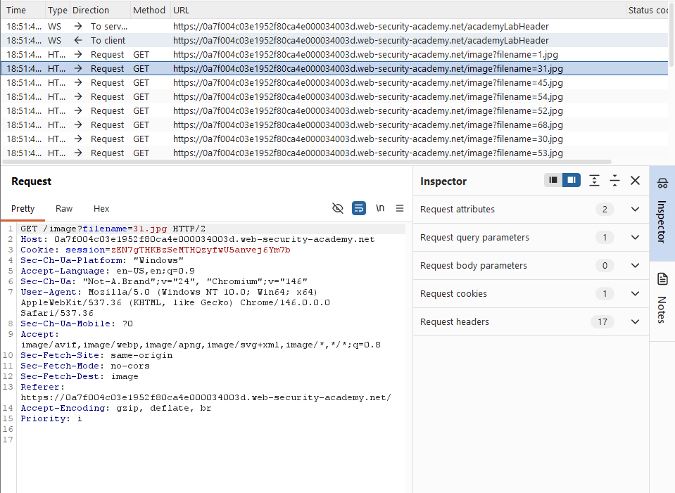
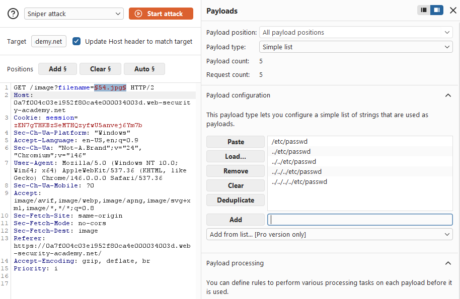
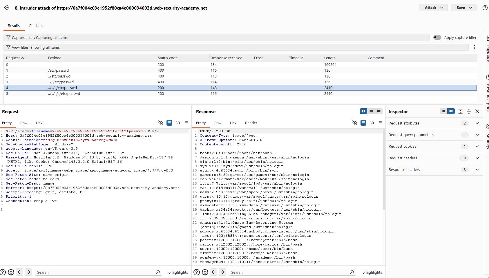

# Lab: File path traversal, simple case

## Description

Retrieve the contents of the /etc/passwd file.

## Walkthrough

### Intercept traffic

First, we need to enable Burp Suite to access the website. To do this, I turned on Intercept from the Proxy tab and opened the website in the Burp Suite browser. I've picked out one request that seems to access an image.

### Modify requested file name

I sent the request from before to the Intruder tab and set the filename parameter as the payload we will be modifying. We don't know for sure what the path is, so I entered multiple possible paths for /etc/passwd.

After starting the attack, we see that a few of the payloads returned a 200 status code. When we open it up, the response shows the /etc/passwd contents in the response.

## Analysis

We were able to access the /etc/passwd file due to a path or directory traversal vulnerability. The client did not restrict what files should be accessible to the public. In real applications, these vulnerabilities would mean that attackers could potentially read any file on the server. The attacker might even be able to write or delete files. To prevent this, websites must implement safeguards to limit the files the client can access. 