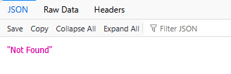
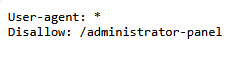
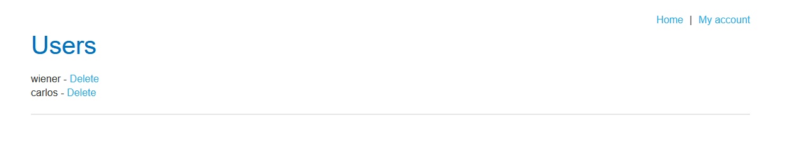

# Lab: Unprotected admin functionality

## Description

This lab has an unprotected admin panel. Delete the user "carlos".

## Walkthrough

The lab opens to a blog page, and we are tasked with deleting a user.

### Finding the admin page

First, let's try to find the admin page. Let's try /admin.

That didn't work, so let's look at the robots.txt file instead.

Here is it! Now, let's see what we have available there.

Here we can delete carlos! With that, this lab is over.

## Analysis

This lab takes us through a vertical escalation vulnerability, where users can gain access to functionality they should not have permission to access.